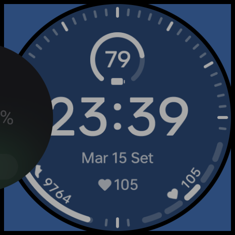
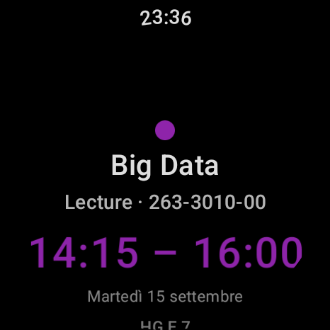

# PolyWear

A **Wear OS** app that shows your ETH Zürich class schedule on your watch — your
week grouped by day, with the next class in focus — plus a small phone companion
that handles login.

> **Unofficial.** PolyWear is an independent, personal project. It is **not
> affiliated with, endorsed by, or supported by ETH Zürich**. "ETH", "eduapp",
> and the ETH logo belong to ETH Zürich; this project does not use them as its
> branding. PolyWear only accesses *your own* schedule, using *your own* login.

## Features

- 📅 Current week grouped by day, today highlighted
- ⏭️ **Browse to next / previous weeks** (regrouped instantly from cache within a
  semester; fetches on demand when you cross into another semester)
- 🎯 Opens focused on your next (or ongoing) class, not the top of the list
- 🎨 Per-course colours; tap a class for full details (time, location, category)
- ⌚ Watch-face **complication** showing your next class
- ✈️ Offline-friendly: the last fetched week is cached and shown when the watch
  has no connection

<p align="center">
  
  
  
</p>

## How it works — two apps

`GET https://eduapp.ethz.ch/web/gw/schedule?semkez=<sem>` requires authentication
(returns `401` otherwise), and ETH's login is not an openly registerable OAuth2
server — so a watch-only OAuth flow (`RemoteAuthClient`) can't register the
required redirect URI. Instead:

- **`:mobile`** runs the real eduapp web login in a WebView, captures the
  resulting session credential, and sends it to the watch over the **Wearable
  Data Layer**.
- **`:wear`** stores the credential (encrypted), calls the schedule API directly,
  filters to the selected week, and renders a day-grouped list.

Both modules share the same `applicationId` (`ch.ncavallini.polywear`) so the Data
Layer associates them automatically. They must be **signed with the same key**.

### API notes

- **Auth is a session cookie** (`credentials: include`, no `Authorization`
  header). The phone captures it via `CookieManager`; the watch replays it as a
  `Cookie` header (`AuthInterceptor`).
- The endpoint returns a **top-level JSON array** of lessons. Each lesson has
  `id`, `type` (`V`=Lecture, `U`=Exercise, `P`=Lab, `S`=Seminar), `code`,
  `semkez`, `start`/`end` (**UTC**, `...Z`), `locations` (string array; may
  contain `"n / a"`), and `title` (language map, e.g. `{"de": "..."}`). Modelled
  in `LessonDto`, mapped by `ScheduleMapper` (UTC → Europe/Zurich).
- `semkez` = `YYYY` + `W` (Winter/Herbst) or `S` (Summer/Frühjahr).
  `SemesterUtil.semkezFor` uses mid-Sep / mid-Feb cut-offs — adjust if a semester
  edge lands differently for you.

## Build

The Gradle wrapper JAR is not committed. Either open the project in **Android
Studio** (it generates the wrapper), or run once with a local Gradle 8.11+:
`gradle wrapper`. Then:

```bash
./gradlew :wear:assembleDebug :mobile:assembleDebug
./gradlew :wear:testDebugUnitTest        # unit tests (SemesterUtil, parsing/grouping)
```

## Run

1. In Android Studio **Device Manager**, create a **Wear OS (API 30+)** emulator
   and a **phone** emulator, then **pair** them (Wear emulator ⋮ → Pair with
   phone). Pairing is required for the Data Layer.
2. Install `:mobile` on the phone and `:wear` on the watch.
3. On the phone, open **PolyWear Login**, sign in to eduapp, then tap **Send
   credential to watch**.
4. On the watch, open **PolyWear**. It loads the current week grouped by day, with
   today highlighted. Swipe/tap **Prev / Next** to move between weeks. Airplane-mode
   the watch to see the cached (offline) view; a `401` shows the "open the phone
   app to sign in" prompt.

## Project layout

```
:mobile   LoginActivity (WebView) · CredentialCapturer · CredentialSender
:wear     ui/    Compose Wear — ScheduleScreen + ScheduleViewModel, DetailScreen
          data/  ScheduleApi, ScheduleRepository, ScheduleMapper, cache, DTOs
          auth/  CredentialListenerService, TokenStore, AuthInterceptor
          util/  SemesterUtil
```

Package: `ch.ncavallini.polywear`.

## Limitations

- Credential capture is inherently brittle: eduapp login/UI changes can break it.
- No silent refresh: when the credential expires, re-auth on the phone.
- **Personal use only.** Automating login / reusing a session cookie may bump
  against ETH's Acceptable Use Policy — see the disclaimer above. Do not
  distribute this using ETH's name or logo, and keep it non-commercial.

## License

No license is granted yet — see the repository owner. (Add a `LICENSE` file before
accepting contributions or redistributing.)
